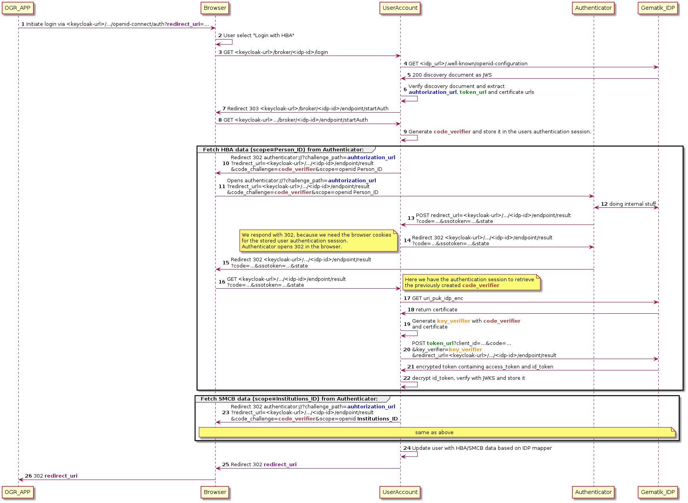

# Gematik IDP

[IDP plugin](https://www.keycloak.org/docs/latest/server_development/index.html#identity-brokering-apis) to integrate 
the gematik central-IDP with the gematik Authenticator application.
Allows an user to login with his HBA (Heil-Berufs-Ausweis) card, supplying HBA and SMCB (Elektronischer
Praxis-/Institutionsausweis) card information.

Additionally, HBA- and SMCB-specific IDP mappers are provided.

Please be aware, that this plugin is written for Keycloak in Version 19 and below. Keycloak 20 support will be added
later, including support for the new admin console theme.

## Installation
1. Run `mvn clean install` in this directory.
2. After completion, install `gematik-idp-1.0.0-SNAPSHOT.jar` into your Keycloak instance by copying it into your Docker
container under `/opt/keycloak/providers/` and rebuilding the [Quarkus environment](https://www.keycloak.org/server/containers). 
3. Add the new Identity Provider `gematik-idp` following the official guide [Integrating identity providers](https://www.keycloak.org/docs/latest/server_admin/index.html#_identity_broker).
Specific configuration properties are listed below.

## Configuration

| Name                                 | Value                                                                                                                                               | Description                                                                                                                                                                                                                                                                                            |
|--------------------------------------|-----------------------------------------------------------------------------------------------------------------------------------------------------|--------------------------------------------------------------------------------------------------------------------------------------------------------------------------------------------------------------------------------------------------------------------------------------------------------|
| Authenticator Url                    | http://localhost:8000   http://localhost:39000   authenticator://                                                                           | Url to open the Authenticator app   if `authenticator://`, Authenticator app is started, if it has not already been started and response is opened in a new tab   if `http://localhost:8000` or `http://localhost:39000` Authenticator app needs to be running, response is opened in same tab |
| Authenticator IDP Authorization Url  |                                                                                                                                                     | Authorization endpoint of the central IDP, used in the Authenticator. Should be extracted from the openid-configuration.                                                                                                                                                                           |
| Authenticator Timeout (ms)           | default: 20000                                                                                                                                      | Timeout in milliseconds until the process of establishing a connection to the Authenticator is aborted                                                                                                                                                                                                 |
| Gematik IDP openid configuration url | https://idp.app.ti-dienste.de/.well-known/openid-configuration   https://idp.zentral.idp.splitdns.ti-dienste.de/.wellknown/openid-configuration | https://idp.app.ti-dienste.de availble from public internet   https://idp.zentral.idp.splitdns.ti-dienste.de/ only available from TI (Telematik-Infrastruktur)                                                                                                                                     |
| Gematik IDP timeout (ms)             | default: 10000                                                                                                                                      | Timeout in milliseconds until the process of establishing a connection to the Gematik IDP is aborted                                                                                                                                                                                                   |
| Gematik IDP User-Agent               |                                                                                                                                                     | User-Agent Header as specified in "gemILF_PS_eRp - A_20015-01": `<Produktname>/<Produktversion> <Herstellername>/<client_id>`                                                                                                                                                                          |
| Client ID                            |                                                                                                                                                     | Client ID to verify your request on C-IDP side. Assigned on registration for the IDP on Gematik side                                                                                                                                                                                                   |
| Default Scopes                       | default: openid                                                                                                                                     | Scopes to send on each request. Atm. "gem-auth" is required, because Fachdienst registration is missing.                                                                                                                                                                                               |

## Flow Diagram

1. User initiated login
2. User selects the `Login with HBA`, which triggers the gematik-idp
3. First call to Keycloak, initiating the IDP flow
4. Keycloak fetches the openid-configuration from C-IDP: [example configuration](docs/openid-config.json)
5. C-IDP responds with the openid-configuration as JWS
6. Keycloak verifies the JWS and extracts the following claims:
    - issuer
    - authorization_endpoint
    - token_endpoint
    - jwks_uri
    - uri_puk_idp_enc
    - uri_puk_idp_sig
    - exp (expiration time)
7. After fetchting the config, Keycloak redirects the user to /startAuth
8. /startAuth is called from the browser
9. Keycloak generates `code_verifier` and store it in the session of the user
10. Generate the deeplink to the authenticator, passing among other things
    1. challenge_path: url to the C-IDP
    2. redirect_url: url to Keycloak
    3. code_challenge: generate `code_verifier`
    4. scope: Person_ID for HBA, Institutions_ID for SMCB
11. User opens Authenticator app
12. Authenticator app and C-IDP communicate, exchanging certificates and HBA/SMCB data
13. Authenticator calls `redirect_url` **subject to change**
14. Keycloak responds with 302, because Keycloak needs the browser to make the call, to retrieve the user session
15. Authenticator redirects on 302 to the browser / open a new tab
16. User browser calls `redirect_url`
17. Keycloak fetches certificate from C-IDP
18. C-IDP returns certificate
19. Keycloak generates `key_verifier` with the certificate and `code_verifier` from user session
20. Call to C-IDP to retrieve ID-token
21. Responds with json, which contains id_token and access_token as JWE
22. Keycloak decrypts id_token, verifies it and stores [HBA data](docs/hba-id-token.json) in the session
23. Second deeplink to fetch [SMCB data](docs/smcb-id-token.json), scope changed to Institutions_ID
    - same flow as 11 - 22 is executed
24. Keycloak updates the user, based on IDP-mapper with the stored HBA/SMCB data
25. Keycloak calls initial redirect_url,
26. Return the user to the initial application
